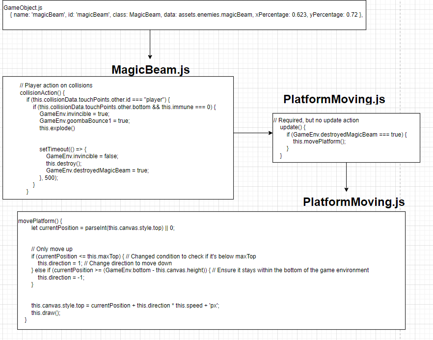

Blog

## JavaScript GameObjects to GameLevel

A java script game object is an object such as platforms, coins, and game objects. To add them to a game level, their functions and properties have to be properly described so that the computer can read and translate it to what is seen on screen. 

<code>
movePlatform() {
        let currentPosition = parseInt(this.canvas.style.top) || 0;

        // Only move up
        if (currentPosition <= this.maxTop) { // Changed condition to check if it's below maxTop
            this.direction = 1; // Change direction to move down
        } else if (currentPosition >= (GameEnv.bottom - this.canvas.height)) { // Ensure it stays within the bottom of the game environment
            this.direction = -1;
        }

        this.canvas.style.top = currentPosition + this.direction * this.speed + 'px';
        this.draw();
    }
<code>

In the platform code above, it defines the action of the game object. The constructors provide the variables needed to construct the object, such as the image, direction and x and y percentages. For the moving platform, we wanted it to carry out a specific function that is set off by the player. We created a movePlatform function describes the objects function. 

To add it to our game level, we added it to Quidditch Game Setter

<code>
const objects = [
    // GameObject(s), the order is important to z-index...
    { name: 'quidditch', id: 'background', class: Background, data: assets.backgrounds.quidditch },
    { name: 'turf', id: 'platform', class: Platform, data: assets.platforms.turf },
    { name: 'blocks', id: 'jumpPlatform', class: BlockPlatform, data: assets.platforms.cobblestone, xPercentage: 0.1, yPercentage: 0.81 },
    { name: 'blocks', id: 'jumpPlatform', class: BlockPlatform, data: assets.platforms.cobblestone, xPercentage: 0.14, yPercentage: 0.81 },
    { name: 'blocks', id: 'jumpPlatform', class: BlockPlatform, data: assets.platforms.cobblestone, xPercentage: 0.18, yPercentage: 0.81 },
    { name: 'blocks', id: 'jumpPlatform', class: BlockPlatform, data: assets.platforms.cobblestone, xPercentage: 0.22, yPercentage: 0.81 },
    { name: 'blocks', id: 'jumpPlatform', class: BlockPlatform, data: assets.platforms.cobblestone, xPercentage: 0.22, yPercentage: 0.69 },
    { name: 'blocks', id: 'jumpPlatform', class: BlockPlatform, data: assets.platforms.cobblestone, xPercentage: 0.30, yPercentage: 0.81 },
    { name: 'blocks', id: 'jumpPlatform', class: BlockPlatform, data: assets.platforms.cobblestone, xPercentage: 0.30, yPercentage: 0.71 },
    { name: 'blocks', id: 'jumpPlatform', class: BlockPlatform, data: assets.platforms.cobblestone, xPercentage: 0.30, yPercentage: 0.61 },
    { name: 'blocks', id: 'jumpPlatform', class: BlockPlatform, data: assets.platforms.cobblestone, xPercentage: 0.30, yPercentage: 0.33 },
    { name: 'blocks', id: 'jumpPlatform', class: BlockPlatform, data: assets.platforms.cobblestone, xPercentage: 0.30, yPercentage: 0.23 },
    { name: 'blocks', id: 'jumpPlatform', class: BlockPlatform, data: assets.platforms.cobblestone, xPercentage: 0.30, yPercentage: 0.13 },
    { name: 'blocks', id: 'jumpPlatform', class: SpawnPlatform, data: assets.platforms.cobblestone, xPercentage: 0.506, yPercentage: 0.92 },
    { name: 'blocks', id: 'jumpPlatform', class: SpawnPlatform, data: assets.platforms.cobblestone, xPercentage: 0.546, yPercentage: 0.92 },
    { name: 'blocks', id: 'jumpPlatform', class: SpawnPlatform, data: assets.platforms.cobblestone, xPercentage: 0.586, yPercentage: 0.92 },
    { name: 'blocks', id: 'jumpPlatform', class: BlockPlatform, data: assets.platforms.cobblestone, xPercentage: 0.38, yPercentage: 0.57 },
    { name: 'blocks', id: 'jumpPlatform', class: BlockPlatform, data: assets.platforms.cobblestone, xPercentage: 0.38, yPercentage: 0.47 },
    { name: 'blocks', id: 'jumpPlatform', class: BlockPlatform, data: assets.platforms.cobblestone, xPercentage: 0.38, yPercentage: 0.37 },
    { name: 'blocks', id: 'jumpPlatform', class: BlockPlatform, data: assets.platforms.cobblestone, xPercentage: 0.38, yPercentage: 0.27 },
    { name: 'blocks', id: 'jumpPlatform', class: BlockPlatform, data: assets.platforms.cobblestone, xPercentage: 0.38, yPercentage: 0.17 },

    { name: 'blocks', id: 'jumpPlatform', class: MovingPlatform, data: assets.platforms.cobblestone, xPercentage: 0.626, yPercentage: 0.92 },
    { name: 'blocks', id: 'jumpPlatform', class: BlockPlatform, data: assets.platforms.cobblestone, xPercentage: 0.663, yPercentage: 0.586 },
    { name: 'blocks', id: 'jumpPlatform', class: BlockPlatform, data: assets.platforms.cobblestone, xPercentage: 0.700, yPercentage: 0.586 },

    { name: 'blocks', id: 'jumpPlatform', class: BlockPlatform, data: assets.platforms.yellowpattern, xPercentage: 0.456, yPercentage: 1.08 },
    { name: 'blocks', id: 'jumpPlatform', class: BlockPlatform, data: assets.platforms.yellowredpattern, xPercentage: 0.456, yPercentage: 0.985 },
    { name: 'blocks', id: 'jumpPlatform', class: BlockPlatform, data: assets.platforms.yellowpattern, xPercentage: 0.456, yPercentage: 0.89 },
    { name: 'blocks', id: 'jumpPlatform', class: BlockPlatform, data: assets.platforms.lionpattern, xPercentage: 0.456, yPercentage: 0.795 },
    { name: 'blocks', id: 'jumpPlatform', class: BlockPlatform, data: assets.platforms.yellowpattern, xPercentage: 0.456, yPercentage: 0.7 },
    { name: 'blocks', id: 'jumpPlatform', class: BlockPlatform, data: assets.platforms.yellowredpattern, xPercentage: 0.456, yPercentage: 0.605 },
    { name: 'blocks', id: 'jumpPlatform', class: BlockPlatform, data: assets.platforms.yellowpattern, xPercentage: 0.456, yPercentage: 0.51 },
    { name: 'blocks', id: 'jumpPlatform', class: BlockPlatform, data: assets.platforms.lionpattern, xPercentage: 0.456, yPercentage: 0.415 },

    { name: 'draco', id: 'draco', class: Draco, data: assets.enemies.draco, xPercentage: 0.3, minPosition: 0.05, difficulties: ["normal", "hard", "impossible"] },
    { name: 'draco', id: 'draco', class: Draco, data: assets.enemies.draco, xPercentage: 0.5, minPosition: 0.3, difficulties: ["normal", "hard", "impossible"] },
    /**{ name: 'draco', id: 'draco', class: Draco, data: assets.enemies.draco, xPercentage: 0.75, minPosition: 0.5, difficulties: ["normal", "hard", "impossible"] }, //this special name is used for random event 2 to make sure that only one of the Goombas ends the random event */
    { name: 'dementor', id: 'dementor', class: Dementor, data: assets.enemies.dementor, xPercentage: 0.5, minPosition: 0.05 },
    { name: 'dementor', id: 'dementor', class: Dementor, data: assets.enemies.dementor, xPercentage: 0.9, minPosition: 0.5 },

    { name: 'coin', id: 'coin', class: Coin, data: assets.obstacles.snitch, xPercentage: 0.095, yPercentage: 0.7 },
    { name: 'coin', id: 'coin', class: Coin, data: assets.obstacles.snitch, xPercentage: 0.135, yPercentage: 0.7 },
    { name: 'coin', id: 'coin', class: Coin, data: assets.obstacles.snitch, xPercentage: 0.175, yPercentage: 0.7 },
    { name: 'coin', id: 'coin', class: Coin, data: assets.obstacles.snitch, xPercentage: 0.375, yPercentage: 0.7 },
    { name: 'coin', id: 'coin', class: Coin, data: assets.obstacles.snitch, xPercentage: 0.409, yPercentage: 0.7 },
    { name: 'coin', id: 'coin', class: Coin, data: assets.obstacles.snitch, xPercentage: 0.295, yPercentage: 0.46 },

    { name: 'chocoFrog', id: 'chocoFrog', class: ChocoFrog, data: assets.enemies.chocoFrog, xPercentage: 0.30, yPercentage: 0.45},

    { name: 'magicBeam', id: 'magicBeam', class: MagicBeam, data: assets.enemies.magicBeam, xPercentage: 0.623, yPercentage: 0.72 },

    { name: 'coin', id: 'coin', class: Coin, data: assets.obstacles.snitch, xPercentage: 0.656, yPercentage: 0.46 },
    { name: 'coin', id: 'coin', class: Coin, data: assets.obstacles.snitch, xPercentage: 0.611, yPercentage: 0.46 },
    { name: 'coin', id: 'coin', class: Coin, data: assets.obstacles.snitch, xPercentage: 0.700, yPercentage: 0.46 },

    { name: 'harry', id: 'player', class: PlayerQuidditch, data: assets.players.harry },
    { name: 'tube', id: 'finishline', class: FinishLine, data: assets.obstacles.tube, xPercentage: 0.85, yPercentage: 0.855 },
    { name: 'tubeU', id: 'minifinishline', class: FinishLine, data: assets.obstacles.tubeU, xPercentage: 0.69, yPercentage: 0.9 },
    { name: 'waterEnd', id: 'background', class: BackgroundTransitions,  data: assets.transitions.waterEnd },
  ];

  const GameQuidditch = {
    tag: 'Quidditch',
    assets: assets,
    objects: objects
  };

export default GameQuidditch;
<code>

As you can see above, the game object (moving platform) is called and implemented into the code along with other game objects relevant to the quidditch game level. 

Game loops are part of game control. The game level is called from GameEnv in the update method. In the update, the game environment is updated and rendered according to the state its in. if the current level is defined, it runs the level until the level is complete, then transitions to the next level. if there is no current level, like at the end of the game, it goes back to the first level. the requestAnimationFrame runs this over and over infinately making a loop. 

<code>
gameLoop() {
                    // Turn game loop off during transitions
                    if (!this.inTransition) {
                        // Get current level
                        GameEnv.update();
                        const currentLevel = GameEnv.currentLevel;
                        // currentLevel is defined
                        if (currentLevel) {
                            // run the isComplete callback function
                            if (currentLevel.isComplete && currentLevel.isComplete()) {
                                const currentIndex = GameEnv.levels.indexOf(currentLevel);
                                // next index is in bounds
                                if (currentIndex !== -1 && currentIndex + 1 < GameEnv.levels.length) {
                                    // transition to the next level
                                    this.transitionToLevel(GameEnv.levels[currentIndex + 1]);
                                } 
                            }
                        // currentLevel is null, (ie start or restart game)
                        } else {
                            // transition to beginning of game
                            this.transitionToLevel(GameEnv.levels[0]);
                        }
                    }
                    // recycle gameLoop, aka recursion
                    requestAnimationFrame(this.gameLoop.bind(this));  
                },
<code>       
        
## transition to new levels

to transition to new levels, the transitionToLevel method is used. newLevel represents the new level to be transitioned to from the current level. To transition to a new level, the current level must be completed, or must be at the start or end of them game. In gameLoop, this.transitionToLevel is called only when the level is at the beginning, end, or if the level is completed. 

<code>
async transitionToLevel(newLevel) {
                    this.inTransition = true;

                    // Destroy existing game objects
                    GameEnv.destroy();

                    // Load GameLevel objects
                    if (GameEnv.currentLevel !== newLevel) {
                        GameEnv.claimedCoinIds = [];
                    }
                    await newLevel.load();
                    GameEnv.currentLevel = newLevel;

                    // Update invert property
                    GameEnv.setInvert();
                    
                    // Trigger a resize to redraw canvas elements
                    window.dispatchEvent(new Event('resize'));

                    this.inTransition = false;
                },
<code>

 

